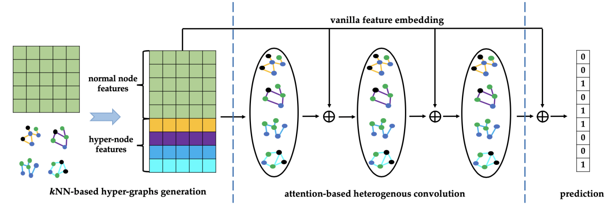
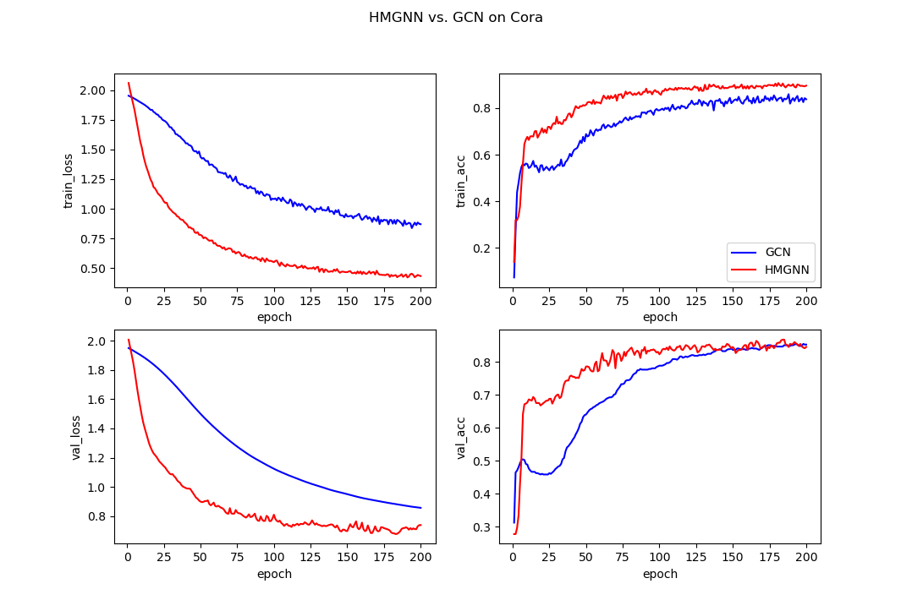

# HMGNN
TensorFlow implementation of Heterogeneous Multiple Mini-Graphs Neural Network  
- usage  
the task of (semi-supervised) classification of nodes in a graph  
- introduction  
We first introduce a kNN-based mechanism to combine diverse yet similar graphs and then the attention mechanism is 
presented to learn the importance of heterogeneous information. To enhance the representation of sparse and 
high-dimensional features, a residual style connection that embeds vanilla features into a hidden state is built.

## overview

## requirements
tensorflow (>=1.12)  
pandas  
numpy

## quick-start
`python HMGNN.py`

### Data
The data used in quick-start is the Cora dataset.  
The Cora dataset consists of 2708 scientific publications classified into one of seven classes.  
The Cora dataset has saved as .npy in dir ./data
- labels.npy:    shape=(2708, 7)  
each publication is classified into one of seven classes.
- features.npy:  shape=(2708, 1433)  
each publication is described by a 0/1-valued word vector. The dictionary consists of 1433 words.
- edges_mat.npy: shape=(2, 10556)  
The graph consists of 10556 links, and each element in edges_mat.npy represents node_id.

### parameters explain
The parameters are defined in `hparam.py`. Main parameters conclude:
- feature dimensions: feature_dim=1433
- epochs=10
- learning_rate=0.0005
- whether or not using attention: attention=True
- whether or not using vanilla features: residual=True

### performance

